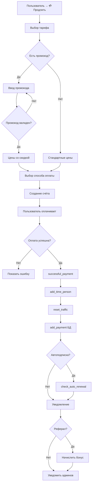
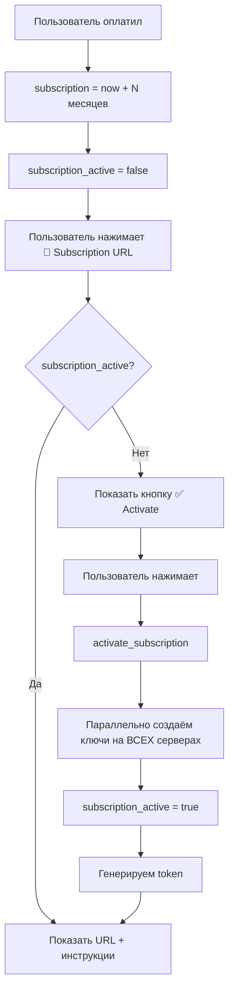
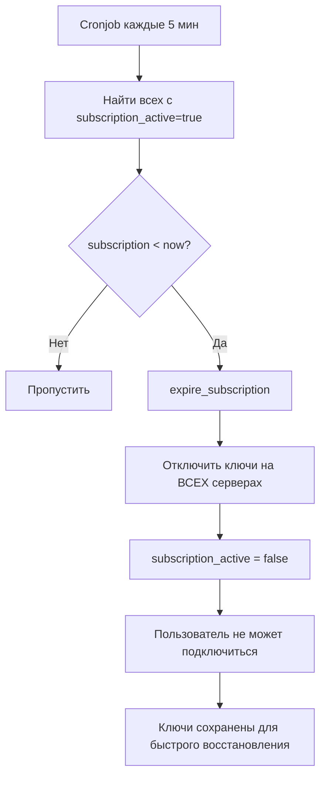
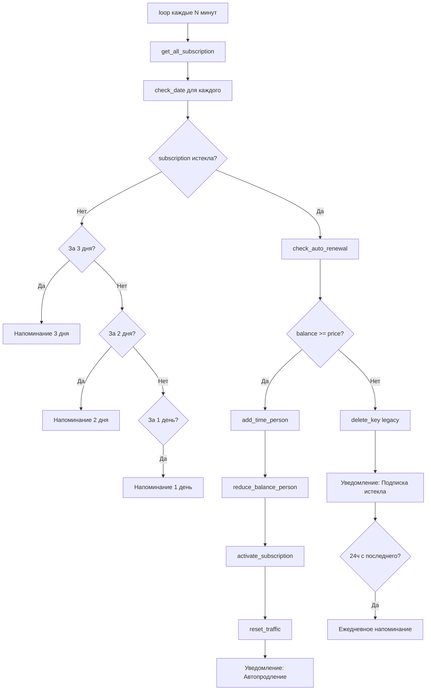
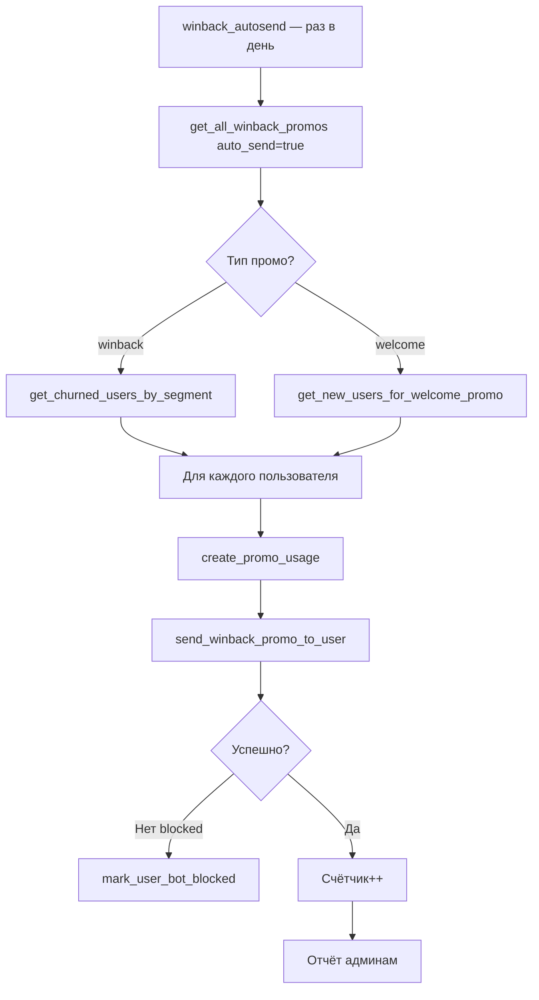
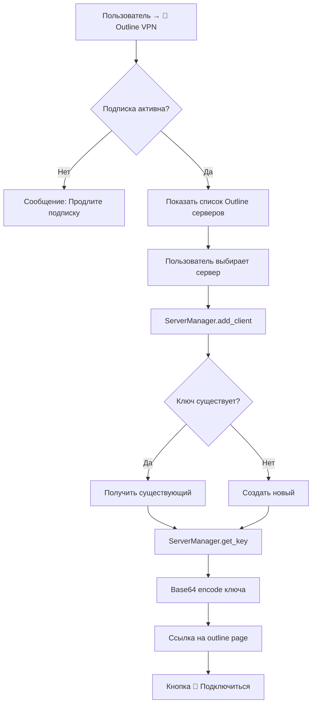
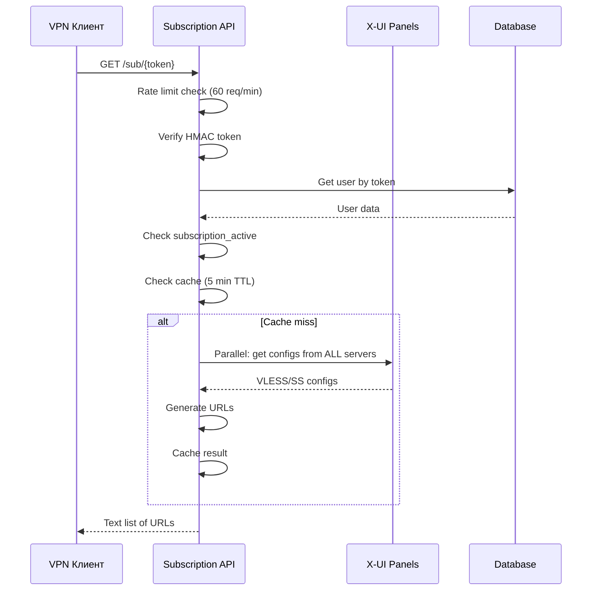

# VPN Bot - Бизнес-логика

**Обновлено**: 2026-01-20
**Бот**: @NoBorderVPN_bot

---

## 1. Архитектура системы

### 1.1 Типы VPN серверов

| type_vpn | Протокол | В подписке | Примечание |
|----------|----------|------------|------------|
| **0** | Outline | **Нет** | Отдельная система, свои ключи |
| **1** | VLESS Reality | **Да** | Основной, "Youtube без рекламы" |
| **2** | Shadowsocks 2022 | **Да** | В unified subscription |

**Важно**: Outline **НЕ входит** в subscription систему. Ключи создаются отдельно.

### 1.2 Unified Subscription

Пользователь получает **один URL**, который содержит ключи ко всем VLESS и SS серверам:

```
https://vpnnoborder.sytes.net/sub/{token}
```

Ответ API — текстовый список (один URL на строку):
```
vless://UUID@1.2.3.4:443?type=tcp&security=reality&...#Германия
vless://UUID@5.6.7.8:443?...#Нидерланды
ss://BASE64@9.10.11.12:443#Россия
```

---

## 2. Процесс оплаты

### 2.1 Способы оплаты

| Система | Валюта | Конверсия | Статус |
|---------|--------|-----------|--------|
| **Telegram Stars** | XTR | 1₽ = 0.5⭐ | ✅ Основной |
| **KassaSmart** | RUB | 1:1 | ✅ Активен |
| **Lava** | RUB | 1:1 | ✅ Активен |
| **Cryptomus** | Crypto | По курсу | ✅ Активен |
| **CryptoBot** | Crypto | По курсу | ✅ Активен |
| **YooMoney** | RUB | 1:1 | ❌ Отключен |

### 2.2 Flow оплаты



### 2.3 successful_payment() — что происходит

```python
# Файл: bot/misc/Payment/payment_systems.py

1. Логирование платежа
2. Яндекс.Метрика — офлайн конверсия (если есть client_id)
3. add_time_person() — добавление дней к subscription
4. reset_user_traffic() + reset_bypass_traffic() — сброс счётчиков
5. add_retention_person() — инкремент retention
6. add_payment() — запись в таблицу payments
7. check_auto_renewal() — проверка автоподписки
8. Реферальные начисления (если есть referral_user_tgid)
9. Уведомление пользователя с кнопкой "🔑 Подключиться к VPN"
10. Уведомление всех админов
```

### 2.4 Тарифы

| Период | Цена | Дней |
|--------|------|------|
| 1 месяц | CONFIG.month_cost[0] | 31 |
| 3 месяца | CONFIG.month_cost[1] | 93 |
| 6 месяцев | CONFIG.month_cost[2] | 186 |
| 12 месяцев | CONFIG.month_cost[3] | 372 |

### 2.5 Telegram Stars

```python
# Конверсия: рубли / 2 = звёзды
amount = price // 2  # 300₽ = 150⭐

# Payload содержит данные для восстановления
payload = f'{price}|{months_count}'  # "300|31"

# После оплаты Telegram вызывает:
# 1. on_pre_checkout_query() → answer(ok=True)
# 2. on_successful_payment() → PaymentSystem.successful_payment()
```

---

## 3. Процесс активации подписки



### 3.1 activate_subscription() — что происходит

```python
# Файл: bot/misc/subscription.py

1. Получаем ВСЕ активные серверы (type_vpn=1, 2)
2. Фильтруем по лимиту (space < MAX_PEOPLE_SERVER=120)
3. Параллельно (asyncio.gather) создаём ключи:
   - VLESS: add_client() → UUID
   - SS: add_client() → password
4. Обновляем БД:
   - subscription_active = True
   - subscription_token = generate_token()
5. При ошибках → алерт админам
```

**Таймауты**:
- Per server: 10 сек
- Total: 30 сек (медленные серверы пропускаются)

---

## 4. Процесс истечения подписки



### 4.1 expire_subscription() — что происходит

```python
# Файл: bot/misc/subscription.py

1. Находим ВСЕ серверы где есть ключи пользователя
2. Для каждого сервера:
   - VLESS/SS: disable_client() → enable=false
   - Outline: set_data_limit(1 byte) → эффективное отключение
3. subscription_active = false
4. Ключи НЕ удаляются (можно включить заново)
```

**Контейнер**: `subscription_checker_container`
**Логи**: `/app/logs/subscription_expiry.log`

---

## 5. Autopay и напоминания

### 5.1 Типы автопродления

| Тип | Триггер | Источник средств |
|-----|---------|------------------|
| **Balance Autopay** | subscription < now | Баланс пользователя |
| **Payment Method** | После оплаты | Сохранённый метод |

### 5.2 Balance Autopay Flow



### 5.3 check_auto_renewal() — логика

```python
# Файл: bot/misc/loop.py

# Приоритет: сначала максимальный тариф
month_count = {
    CONFIG.month_cost[3]: 12,  # 12 месяцев
    CONFIG.month_cost[2]: 6,   # 6 месяцев
    CONFIG.month_cost[1]: 3,   # 3 месяца
    CONFIG.month_cost[0]: 1,   # 1 месяц
}

for price, months in month_count.items():
    if person.balance >= price:
        1. add_time_person() — добавляем время
        2. reduce_balance_person() — списываем баланс
        3. activate_subscription() — включаем ключи
        4. reset_user_traffic() — сброс трафика
        5. Уведомление с кнопкой "🔑 Мои ключи"
        return True
return False
```

### 5.4 Напоминания

| Когда | Флаг | Действие |
|-------|------|----------|
| За 3 дня | notion_threedays | Сообщение + клавиатура оплаты |
| За 2 дня | notion_twodays | Сообщение + клавиатура оплаты |
| За 1 день | notion_oneday | Сообщение + клавиатура оплаты |
| Истекла | subscription_expired | Фото + сообщение |
| Каждые 24ч | last_expiry_notification | Ежедневное напоминание |

---

## 6. Win-back промо система

### 6.1 Архитектура



### 6.2 Таблицы БД

```sql
-- winback_promos
id                SERIAL PRIMARY KEY
code              VARCHAR(50) UNIQUE     -- "WELCOME30"
discount_percent  INTEGER                -- 30
valid_days        INTEGER                -- 7
min_days_expired  INTEGER                -- 7 (для winback)
max_days_expired  INTEGER                -- 30 (для winback)
promo_type        VARCHAR(20)            -- 'winback' | 'welcome'
delay_days        INTEGER                -- 1 (для welcome - через N дней после регистрации)
auto_send         BOOLEAN                -- true = автоотправка
is_active         BOOLEAN
message_template  TEXT                   -- Кастомный текст (опционально)

-- winback_promo_usage
id                SERIAL PRIMARY KEY
promo_id          INTEGER FK
user_tgid         BIGINT
sent_at           TIMESTAMP
expires_at        TIMESTAMP
used_at           TIMESTAMP              -- NULL если не использован
```

### 6.3 Типы промо

| Тип | Сегмент | Условие |
|-----|---------|---------|
| **winback** | Ушедшие | subscription истекла N-M дней назад |
| **welcome** | Новые | retention=0, зарегистрирован N дней назад |

### 6.4 Проверка промокода

```python
# Файл: bot/database/methods/winback.py → check_promo_code()

1. Найти promo_usage для user_tgid
2. Проверить: expires_at > now
3. Проверить: used_at IS NULL
4. Если валиден → вернуть {discount_percent, valid_days}
```

---

## 7. Outline VPN (отдельная система)

### 7.1 Ключевое отличие

| Параметр | Subscription (VLESS/SS) | Outline |
|----------|------------------------|---------|
| type_vpn | 1, 2 | 0 |
| В unified подписке | ✅ Да | ❌ Нет |
| Ключи создаются | При активации подписки | По запросу пользователя |
| Хранение ключей | На всех серверах сразу | Только выбранный сервер |
| Отключение | disable_client() | set_data_limit(1 byte) |

### 7.2 Flow получения ключа



### 7.3 Outline Page

```
URL: https://vpnnoborder.sytes.net/outline/{base64_key}

Страница содержит:
- Ссылки на скачивание Outline Client
- Ключ в копируемом формате
- Deeplink для автодобавления
- Инструкции по настройке
```

### 7.4 Файлы

| Файл | Назначение |
|------|------------|
| `bot/handlers/user/outline_user.py` | Telegram handlers |
| `bot/misc/VPN/Outline.py` | API интеграция |
| `subscription_api/static/outline.html` | Landing page |

---

## 8. API подписок (/sub/{token})



### 8.1 Security

| Защита | Параметры |
|--------|-----------|
| Rate limit | 60 req/min на IP |
| Brute-force | 10 неудачных попыток → бан 1 час |
| HMAC | SHA256, первые 16 символов |
| Cache | 5 минут TTL |

---

## 9. Клиентские приложения

### 9.1 Рекомендуемые

| Приложение | Платформа | VLESS | SS | Deep link |
|------------|-----------|-------|-----|-----------|
| **Happ** | iOS, Android, Windows | ✅ | ✅ | `happ://add/{url}` |
| **Hiddify** | Все | ✅ | ✅ | — |
| **V2RayNG** | Android | ✅ | ✅ | — |
| **Shadowrocket** | iOS (платный) | ✅ | ✅ | — |

### 9.2 НЕ работает

| Приложение | Причина |
|------------|---------|
| **v2rayN** | Баг с VLESS Reality |

### 9.3 Для Outline (отдельно)

| Приложение | Платформа |
|------------|-----------|
| **Outline Client** | Все |

---

## 10. База данных

### 10.1 Таблица users (ключевые поля)

```sql
-- Подписка
subscription          BIGINT    -- Unix timestamp истечения
subscription_active   BOOLEAN   -- Активна ли сейчас
subscription_token    VARCHAR   -- HMAC токен (UNIQUE)
subscription_expired  BOOLEAN   -- Истекла ли

-- Трафик
total_traffic_bytes   BIGINT    -- Использовано
traffic_limit_bytes   BIGINT    -- Лимит (по умолчанию безлимит)
bypass_traffic_bytes  BIGINT    -- Bypass трафик (отдельный счётчик)

-- Legacy (для Outline)
server                INTEGER   -- ID сервера
client_id             VARCHAR   -- ID ключа на Outline сервере
```

### 10.2 Таблица servers

```sql
id          INTEGER PRIMARY KEY
name        VARCHAR UNIQUE       -- "🇩🇪 Германия"
type_vpn    INTEGER              -- 0=Outline, 1=VLESS, 2=SS
ip          VARCHAR              -- IP адрес
work        BOOLEAN              -- Включен ли
space       INTEGER              -- Кол-во пользователей
is_bypass   BOOLEAN              -- Сервер для обхода whitelist
```

### 10.3 Таблица subscription_logs

```sql
user_id       INTEGER FK
ip_address    VARCHAR(45)
user_agent    VARCHAR(255)        -- "Happ/1.5.2/Windows"
servers_count INTEGER             -- Сколько серверов в ответе
accessed_at   TIMESTAMP
```

---

## 11. Лимиты и ограничения

| Параметр | Значение | Где |
|----------|----------|-----|
| Трафик | **Безлимит** (по умолчанию) | .env: `LIMIT_GB=0` |
| IP | **Безлимит** | .env: `LIMIT_IP=0` |
| Пользователей на сервер | **120** | .env: `MAX_PEOPLE_SERVER` |
| Таймаут на сервер | 8 сек | subscription_api/main.py |
| Общий таймаут | 20 сек | subscription_api/main.py |
| Cache TTL | 5 мин | subscription_api/main.py |

---

## 12. Диагностика проблем

### 12.1 Проверить пользователя

```sql
SELECT tgid, username,
       subscription_active,
       to_timestamp(subscription) as expires,
       subscription_token IS NOT NULL as has_token
FROM users WHERE tgid = {TELEGRAM_ID};
```

### 12.2 Проверить API

```bash
curl -s "http://localhost:8003/sub/{TOKEN}" | head -5
```

### 12.3 Проверить логи доступа

```sql
SELECT accessed_at, user_agent, servers_count
FROM subscription_logs
WHERE user_id = {USER_ID}
ORDER BY id DESC LIMIT 5;
```

### 12.4 Частые проблемы

| Симптом | Причина | Решение |
|---------|---------|---------|
| VPN не подключается | Неправильное приложение | Использовать Happ/Hiddify |
| subscription_active=false | Не активировал | Нажать "Activate" в боте |
| client_id пустой | Новая система | Нормально, используется token |
| API возвращает 403 | Подписка истекла | Проверить subscription timestamp |
| API возвращает 429 | Rate limit | Подождать минуту |

---

## 13. Файловая структура

| Компонент | Файл | Назначение |
|-----------|------|------------|
| Логика подписок | `bot/misc/subscription.py` | activate/expire/sync |
| API | `subscription_api/main.py` | /sub/{token} endpoint |
| Генераторы | `subscription_api/config_generators.py` | VLESS/SS URLs |
| Security | `subscription_api/security.py` | Rate limit, brute-force |
| Cronjob | `subscription_expiry_checker.py` | Проверка истечений |
| VLESS | `bot/misc/VPN/Xui/Vless.py` | X-UI интеграция |
| SS | `bot/misc/VPN/Xui/Shadowsocks.py` | X-UI интеграция |
| Outline | `bot/misc/VPN/Outline.py` | Outline API |
| ServerManager | `bot/misc/VPN/ServerManager.py` | Унифицированный интерфейс |

---

## 14. Docker контейнеры

| Контейнер | Назначение |
|-----------|------------|
| `vpnhubbot-vpn_hub_bot-1` | Telegram бот |
| `subscription_api_container` | FastAPI (порт 8003) |
| `subscription_checker_container` | Cronjob (каждые 5 мин) |
| `postgres_db_container` | PostgreSQL 16 |

---

## 15. Продакшн URLs

| Назначение | URL |
|------------|-----|
| Subscription API | `https://vpnnoborder.sytes.net/sub/{token}` |
| Add page (HTML) | `https://vpnnoborder.sytes.net/add/{token}` |
| Deep link | `happ://add/https://vpnnoborder.sytes.net/sub/{token}` |

---

**Создано**: 2026-01-20
**Автор**: Claude Code
